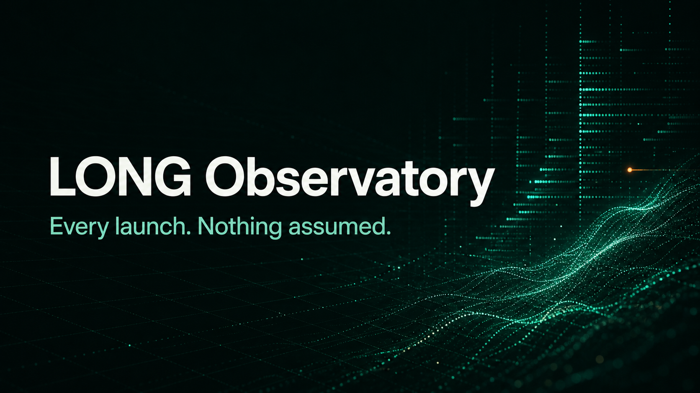

# LONG Observatory



[Live dashboard](https://snobistisch.github.io/long-launch-tracker/) ·
[Reconnaissance](./RECON.md) ·
[Deployment status](https://github.com/snobistisch/long-launch-tracker/actions/workflows/update-and-deploy.yml)

**Every launch. Nothing assumed.**

A read-only TypeScript tracker for LONG launches on Robinhood Chain. It combines a complete,
chain-filtered snapshot from LONG's public GraphQL index with incremental discovery from the two
observed launcher contracts. Representative records are independently verified against Doppler
Airlock; stock-token numeraires are priced through Robinhood's public `/rhj` API. Normalized
records and a resumable cursor are persisted in SQLite.

The repository includes a zero-wallet public dashboard with 12,758 unique chain-4663 launches
at the initial snapshot, fast search and pagination, numeraire filtering, current
multiplier-adjusted quotes, source provenance, and transaction-level details. GitHub Actions
refreshes the public dataset twice an hour and deploys it to Pages.

## How it works

```text
LONG GraphQL snapshot (chain 4663) ── launcher-event RPC updates
                    ↓                         ↓
              normalized records + resumable cursor
                    ↓                         ↑
                SQLite ─────────── Robinhood /rhj pricing
                    ↓
          static JSON ── GitHub Pages dashboard
```

The current implementation covers the `long-robinhood` venue on EIP-155 chain `4663`.
`venue_key` and `chain_id` are separate everywhere so a future LongX/Lighter venue does not
require a schema rewrite.

## Requirements

- Node.js 22.6 or newer
- Network access to the public Robinhood Chain RPC and Robinhood `/rhj` endpoints

There are no npm dependencies and no install step. Node's built-in SQLite module is currently
marked experimental, so Node prints a warning when the CLI starts.

## Run

```bash
npm run tracker -- poll
npm run tracker -- watch
```

Run the dashboard locally:

```bash
npm run dashboard:dev
```

The first CLI run without a cursor scans a bounded recent lookback. A deliberate RPC-only
historical reconstruction starts at the verified first LONG launch:

```bash
npm run tracker -- poll --since earliest
# equivalent:
npm run tracker -- poll --since 8145291
```

Useful diagnostic/recovery forms:

```bash
npm run tracker -- poll --since latest
npm run tracker -- poll --since 9721433 --until 9721433 --db /tmp/long-check.sqlite
npm run tracker -- watch --interval 30000
```

Once a database has a cursor, that cursor wins over `--since`; this prevents a watch loop or a
second poll from rescanning old ranges. The Pages updater seeds its cursor from the checked-in
GraphQL backfill and then continues through canonical RPC events. Delete or choose a different
database only when you deliberately want a fresh RPC reconstruction.

`poll` and `watch` always print `Venue` alongside `Chain`. SQLite likewise stores `venue_key`
and `chain_id` in separate columns.

## Configuration

Copy `.env.example` to `.env` only when overrides are needed. `.env` and SQLite data files are
gitignored. The checked-in defaults are all public endpoints and contracts observed during
reconnaissance; no wallet, transaction, private key, authentication, or paid service is used.

Important controls:

- `LONG_RPC_BLOCK_SPAN` defaults to 20,000 and is hard-capped at 100,000.
- `LONG_RPC_CONCURRENCY` defaults to 2.
- `LONG_RPC_REQUESTS_PER_SECOND` defaults to 8.
- `LONG_CONFIRMATIONS` defaults to 64.
- `LONG_DEFAULT_LOOKBACK_BLOCKS` defaults to 100,000.

Every `eth_getLogs` request is rejected locally unless it contains one exact launcher address,
the exact `LaunchCreated` topic0, and a span no larger than the configured cap. The cursor moves
only after both launcher queries, all enrichment calls, and all SQLite writes for a range have
succeeded.

The scheduled dashboard job uses a stricter 2,000-block span to match the current limit of the
public Robinhood Chain backend.

## Normalized record

Each SQLite launch contains:

- token address, name, and symbol;
- numeraire address, symbol, `currentMultiplier`, and adjusted USD bid/ask/mid;
- pool/hook address and creator;
- block, timestamp, transaction hash, and log index;
- venue key, EIP-155 chain ID, and source provenance;
- a visible pricing error when the optional USD layer is temporarily unavailable.

The quote leg is read from `Airlock.getAssetData(asset)` for every launch and checked against
the event. It is never assumed to be ETH, USDG, or a particular stock.

## Tests

```bash
npm test
```

The tests cover receipt decoding, Airlock tuple decoding, exact multiplier arithmetic, SQLite
deduplication, and the invariant that venue and chain remain separate fields.

See [RECON.md](./RECON.md) for addresses, event signatures, evidence, source ranking, and known
limitations.
